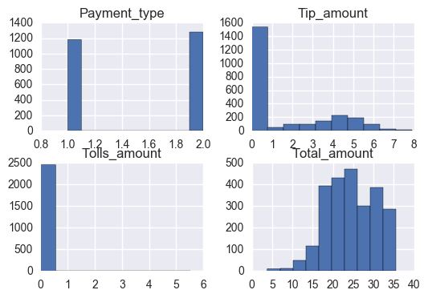

# Capital One Data Science Challenge 

By Cliff Green

## Introduction 
- Today I will be exploring data provided The New York City Taxi & Limosine Commission. The NYU TLC aggregated trip data recorded during recorded by technology providers implemented under the Taxicab & Livery Passenger Enhancement Program. It is important to note that the TLC does not guarantee accuracy of the data provided. There are three main type of services offered by Taxi Cabs in New York. The first is the Yellow line which only provides transportation through off the street hails. The second is FHVs which exclusively works with prearranged trips, this includes a limo service. The third method is a green cab which can accept street hails above 110th street and in out boroughs but can only pick up prearranged rides when not in those established areas. Let’s see what fun things we can learn!


Prior to any analysis, I think it’s important to understand the data, and each variable in the dataset. A thorough explanation can be found here. http://www.nyc.gov/html/tlc/downloads/pdf/data_dictionary_trip_records_green.pdf

First I import the required libraries, pandas for dataframes, request/io for pulling stuff offline, matplot for data visualization and numpy for math functions


```python
#I was pretty ambition with what I thought I was going to use
import sys
import pandas as pd
import requests, io
import matplotlib
import matplotlib.pyplot as plt

import numpy as np
import scipy.stats as stats

import sklearn
from sklearn import linear_model
from sklearn import metrics
from sklearn import cross_validation
from sklearn.preprocessing import scale
from sklearn.linear_model import LinearRegression
from sklearn.linear_model import LogisticRegression
from sklearn.decomposition import PCA
from sklearn.cross_decomposition import PLSRegression, PLSSVD
from sklearn.metrics import r2_score
from sklearn.metrics import mean_squared_error
from sklearn.metrics import explained_variance_score

import math
from math import sqrt
import statsmodels.api as sm
import seaborn as sns
import warnings
warnings.filterwarnings('ignore')
%matplotlib inline
```

# Question 1
  - Programmatically download and load into your favorite analytical tool the trip data for September 2015.
  
  - Report how many rows and columns of data you have loaded.

## Part 1

Downloading the Data and Loading into Python:


```python
url = 'https://s3.amazonaws.com/nyc-tlc/trip+data/green_tripdata_2015-09.csv'
s = requests.get(url).content
SeptData = pd.read_csv(io.StringIO(s.decode('iso-8859-1')))
```

## Part 2

Counting Rows and Columns

```python

SeptData.shape[1]
#number of columns- 21
SeptData.shape[0]
#number of rows - 1494926
```

This Dataset has 1494926 rows and 21 columns

# Question 2
   - Plot a histogram of the number of the trip distance ("Trip Distance").
    
   - Report any structure you find and any hypotheses you have about that structure.


##### Using the code shown below I created a quick histogram from the data.


```python
SeptData['Trip_distance'].hist(bins=20 )# creating a histogram for trip distance
plt.suptitle('Histogram of Travel Distance', fontsize=20)
plt.xlabel('Distance', fontsize=18)
plt.ylabel('Occurrences ', fontsize=16)
```


    <matplotlib.text.Text at 0x13584c95fd0>


Obviously, the figure tells us very little about the actual dataset, so some cleaning is necessary. The first thing I did was look at the distribution of each variable


```python

```

### Observing the data further 

 - I wrote this cool chunk of code a while ago, I know it’s pretty messy and I should definitely write something cleaner but given the time constraint I have decided to use this.  The code essentially provides you with the max and min for each given column in two seperate data frames. For this analysis, I only chose columns where I felt like I would benefit from this information. The columns were Passenger Count, Trip Distance, Fare Amount, Extra, MTA tax, Tip Amount, Tolls, Amount, Improvement surcharge, Total Amount, and payment type. I know that a lot of this information is provided in the describe feature above, but this really helps me get a better idea of the kinds outliers I am working with.


```python
NewData = SeptData[['Passenger_count','Trip_distance','Fare_amount','Extra','MTA_tax','Tip_amount', 'Tolls_amount','improvement_surcharge' ,'Total_amount','Payment_type']]
L = NewData.columns.values.tolist()
Max = pd.DataFrame()
Min = pd.DataFrame()
L = pd.Series(L)
for i in NewData:
     Max = pd.concat([Max, pd.DataFrame(NewData.loc[[NewData[i].argmax()]])])
     Min = pd.concat([Min, pd.DataFrame(NewData.loc[[NewData[i].argmin()]])])    

Max['Variable'] = L.values   
Min['Variable'] = L.values
```


```python
Max
```


<div>
<table border="1" class="dataframe">
  <thead>
    <tr style="text-align: right;">
      <th></th>
      <th>Passenger_count</th>
      <th>Trip_distance</th>
      <th>Fare_amount</th>
      <th>Extra</th>
      <th>MTA_tax</th>
      <th>Tip_amount</th>
      <th>Tolls_amount</th>
      <th>improvement_surcharge</th>
      <th>Total_amount</th>
      <th>Payment_type</th>
      <th>Variable</th>
    </tr>
  </thead>
  <tbody>
    <tr>
      <th>18481</th>
      <td>9</td>
      <td>0.00</td>
      <td>0.30</td>
      <td>0.0</td>
      <td>0.0</td>
      <td>0.0</td>
      <td>0.00</td>
      <td>0.0</td>
      <td>0.30</td>
      <td>2</td>
      <td>Passenger_count</td>
    </tr>
    <tr>
      <th>1321961</th>
      <td>1</td>
      <td>603.10</td>
      <td>1.25</td>
      <td>0.5</td>
      <td>0.5</td>
      <td>0.0</td>
      <td>0.00</td>
      <td>0.3</td>
      <td>2.55</td>
      <td>2</td>
      <td>Trip_distance</td>
    </tr>
    <tr>
      <th>560476</th>
      <td>1</td>
      <td>1.18</td>
      <td>580.50</td>
      <td>0.0</td>
      <td>0.5</td>
      <td>0.0</td>
      <td>0.00</td>
      <td>0.3</td>
      <td>581.30</td>
      <td>2</td>
      <td>Fare_amount</td>
    </tr>
    <tr>
      <th>51843</th>
      <td>1</td>
      <td>0.00</td>
      <td>2.65</td>
      <td>12.0</td>
      <td>0.5</td>
      <td>0.0</td>
      <td>0.00</td>
      <td>0.0</td>
      <td>15.15</td>
      <td>2</td>
      <td>Extra</td>
    </tr>
    <tr>
      <th>2</th>
      <td>1</td>
      <td>0.59</td>
      <td>4.00</td>
      <td>0.5</td>
      <td>0.5</td>
      <td>0.5</td>
      <td>0.00</td>
      <td>0.3</td>
      <td>5.80</td>
      <td>1</td>
      <td>MTA_tax</td>
    </tr>
    <tr>
      <th>1045135</th>
      <td>1</td>
      <td>5.76</td>
      <td>29.50</td>
      <td>0.0</td>
      <td>0.5</td>
      <td>300.0</td>
      <td>0.00</td>
      <td>0.3</td>
      <td>330.30</td>
      <td>1</td>
      <td>Tip_amount</td>
    </tr>
    <tr>
      <th>234799</th>
      <td>3</td>
      <td>2.70</td>
      <td>10.50</td>
      <td>0.5</td>
      <td>0.5</td>
      <td>0.0</td>
      <td>95.75</td>
      <td>0.3</td>
      <td>107.55</td>
      <td>4</td>
      <td>Tolls_amount</td>
    </tr>
    <tr>
      <th>2</th>
      <td>1</td>
      <td>0.59</td>
      <td>4.00</td>
      <td>0.5</td>
      <td>0.5</td>
      <td>0.5</td>
      <td>0.00</td>
      <td>0.3</td>
      <td>5.80</td>
      <td>1</td>
      <td>improvement_surcharge</td>
    </tr>
    <tr>
      <th>560476</th>
      <td>1</td>
      <td>1.18</td>
      <td>580.50</td>
      <td>0.0</td>
      <td>0.5</td>
      <td>0.0</td>
      <td>0.00</td>
      <td>0.3</td>
      <td>581.30</td>
      <td>2</td>
      <td>Total_amount</td>
    </tr>
    <tr>
      <th>23808</th>
      <td>1</td>
      <td>0.00</td>
      <td>20.00</td>
      <td>1.0</td>
      <td>0.0</td>
      <td>0.0</td>
      <td>0.00</td>
      <td>0.3</td>
      <td>21.30</td>
      <td>5</td>
      <td>Payment_type</td>
    </tr>
  </tbody>
</table>
</div>


```python
Min
```


<div>
<table border="1" class="dataframe">
  <thead>
    <tr style="text-align: right;">
      <th></th>
      <th>Passenger_count</th>
      <th>Trip_distance</th>
      <th>Fare_amount</th>
      <th>Extra</th>
      <th>MTA_tax</th>
      <th>Tip_amount</th>
      <th>Tolls_amount</th>
      <th>improvement_surcharge</th>
      <th>Total_amount</th>
      <th>Payment_type</th>
      <th>Variable</th>
    </tr>
  </thead>
  <tbody>
    <tr>
      <th>1097</th>
      <td>0</td>
      <td>1.70</td>
      <td>0.0</td>
      <td>0.0</td>
      <td>0.0</td>
      <td>0.00</td>
      <td>0.00</td>
      <td>0.0</td>
      <td>0.00</td>
      <td>2</td>
      <td>Passenger_count</td>
    </tr>
    <tr>
      <th>0</th>
      <td>1</td>
      <td>0.00</td>
      <td>7.8</td>
      <td>0.0</td>
      <td>0.0</td>
      <td>1.95</td>
      <td>0.00</td>
      <td>0.0</td>
      <td>9.75</td>
      <td>1</td>
      <td>Trip_distance</td>
    </tr>
    <tr>
      <th>1021548</th>
      <td>1</td>
      <td>0.00</td>
      <td>-475.0</td>
      <td>0.0</td>
      <td>0.0</td>
      <td>0.00</td>
      <td>0.00</td>
      <td>0.0</td>
      <td>-475.00</td>
      <td>3</td>
      <td>Fare_amount</td>
    </tr>
    <tr>
      <th>21092</th>
      <td>1</td>
      <td>0.00</td>
      <td>-3.0</td>
      <td>-1.0</td>
      <td>-0.5</td>
      <td>0.00</td>
      <td>0.00</td>
      <td>-0.3</td>
      <td>-4.80</td>
      <td>3</td>
      <td>Extra</td>
    </tr>
    <tr>
      <th>196</th>
      <td>1</td>
      <td>0.00</td>
      <td>-2.5</td>
      <td>-0.5</td>
      <td>-0.5</td>
      <td>0.00</td>
      <td>0.00</td>
      <td>-0.3</td>
      <td>-3.80</td>
      <td>3</td>
      <td>MTA_tax</td>
    </tr>
    <tr>
      <th>1164904</th>
      <td>1</td>
      <td>0.76</td>
      <td>-8.0</td>
      <td>0.0</td>
      <td>-0.5</td>
      <td>-50.00</td>
      <td>0.00</td>
      <td>-0.3</td>
      <td>-58.80</td>
      <td>4</td>
      <td>Tip_amount</td>
    </tr>
    <tr>
      <th>1106459</th>
      <td>1</td>
      <td>0.00</td>
      <td>-25.0</td>
      <td>0.0</td>
      <td>0.0</td>
      <td>0.00</td>
      <td>-15.29</td>
      <td>0.0</td>
      <td>-40.29</td>
      <td>2</td>
      <td>Tolls_amount</td>
    </tr>
    <tr>
      <th>196</th>
      <td>1</td>
      <td>0.00</td>
      <td>-2.5</td>
      <td>-0.5</td>
      <td>-0.5</td>
      <td>0.00</td>
      <td>0.00</td>
      <td>-0.3</td>
      <td>-3.80</td>
      <td>3</td>
      <td>improvement_surcharge</td>
    </tr>
    <tr>
      <th>1021548</th>
      <td>1</td>
      <td>0.00</td>
      <td>-475.0</td>
      <td>0.0</td>
      <td>0.0</td>
      <td>0.00</td>
      <td>0.00</td>
      <td>0.0</td>
      <td>-475.00</td>
      <td>3</td>
      <td>Total_amount</td>
    </tr>
    <tr>
      <th>0</th>
      <td>1</td>
      <td>0.00</td>
      <td>7.8</td>
      <td>0.0</td>
      <td>0.0</td>
      <td>1.95</td>
      <td>0.00</td>
      <td>0.0</td>
      <td>9.75</td>
      <td>1</td>
      <td>Payment_type</td>
    </tr>
  </tbody>
</table>
</div>


### What stands out to me?

- The first thing at really stands out to me is that there are a lot of negative numbers where there shouldn’t be. For instance, the fare amount for observation 1021548 is -475.00 and the Toll amount for observation 1106459 is -15.29. Obviously, this shouldn’t be the case. To rectify that I simply trimmed the data in a number of places to remove these values that realistically shouldn’t be possible.

### So what did I end up trimming?

- I decided that passenger count must be less than 6 but greater than 0 people, I dont really see how nine people is possible in a cab. I decided that fare amount had to be at least 2.5 dollars because that is the specified minimum according to the website, therefor total amount had to be at least 2.5 dollars also. I specified that the variables: Extra, Tip amount, and Toll amount had to be greater than or equal to 0. This effectively removed those nasty negative values that I can only assume were errors in data collection. I also deleted Ehail fee because there was 0 variance as shown in the describe function. I then set a threshold for the longitude and latitude varaibles


```python
SeptData = SeptData.loc[SeptData['Passenger_count'] > 0]
SeptData = SeptData.loc[SeptData['Fare_amount'] >= 2.5]
SeptData = SeptData.loc[SeptData['Extra'] >= 0]
SeptData = SeptData.loc[SeptData['Tip_amount'] >= 0]
SeptData = SeptData.loc[SeptData['Total_amount'] >= 2.5]
SeptData = SeptData.loc[SeptData['Tolls_amount'] >= 0]
SeptData = SeptData.loc[SeptData['Trip_distance'] > 0]
del SeptData['Ehail_fee']
SeptData = SeptData.loc[SeptData['Dropoff_latitude'] >= 35]
SeptData = SeptData.loc[SeptData['Pickup_latitude'] >= 35]
SeptData = SeptData.loc[SeptData['Dropoff_longitude'] < 0]
SeptData = SeptData.loc[SeptData['Pickup_longitude'] < 0]
SeptData = SeptData.loc[(SeptData['RateCodeID'] <= 6) & (SeptData['RateCodeID'] >= 1)]
```


```python
SeptData.shape[0] - SeptData.dropna().shape[0]
```


    0


### Handling Outliers

- I also decided that given the large distribution of data points, it might be useful to trim them by a certain number of standard deviations, effectively removing more less significant outliers. I chose for standard deviations, so I am really only clipping extreme outliers. 


```python
Red = SeptData
```


```python
SeptData = Red
```


```python
list = ['Tip_amount','Trip_distance','Fare_amount', 'Total_amount']
for i in list:
    SeptData = SeptData[((SeptData[i] - SeptData[i].mean()) / SeptData[i].std()).abs() < 3]


```

### Plotting a histogram of the cleaned dataset


```python
SeptData['Trip_distance'].hist(bins=20 )
plt.suptitle('Histogram of Travel Distance', fontsize=20)
plt.xlabel('Distance', fontsize=18)
plt.ylabel('Occurrences ', fontsize=16)
```


    <matplotlib.text.Text at 0x1358fe446d8>


The data shows a very hard skew to the left with the majority of the data points less than 10 miles. If I wanted to model on trip distance I would most likely benefit from a transform it prior to analysis. It definitely makes sense that the majority of trips are shorter trips, but that has created a hard skew.

# Question 3
 - Report mean and median trip distance grouped by hour of day.

 - We'd like to get a rough sense of identifying trips that originate or terminate at one of the NYC area airports. Can you provide a count of how many transactions fit this criteria, the average fair, and any other interesting characteristics of these trips.

## Part 1

 First it was necessary to tell python to read the drop-off and pickup times as dates, this was done in the first two lines of code. From here I created a loop that would calculate interesting data points grouped by hour of day. I probably could have used the groupby() function but this code worked for me so I settled with this.


```python
#this wont work until the variable average speed is created. if you want want to run it before that, remove the hash from the trip area below
# and at one to Speed.append and the other Trip Info Varaible.
SeptData['lpep_pickup_datetime'] = pd.to_datetime(SeptData['lpep_pickup_datetime'], format = '%Y-%m-%d %H:%M:%S')#formatting dates
SeptData['Lpep_dropoff_datetime'] = pd.to_datetime(SeptData['Lpep_dropoff_datetime'], format = '%Y-%m-%d %H:%M:%S')
SeptData1 = SeptData.set_index(SeptData['lpep_pickup_datetime'].dt.hour)
hours = SeptData1['lpep_pickup_datetime'].dt.hour.unique()
means = []
medians = []
Tip = []
Cost = []
Speed = []
#the for loop below creates multiple lists containig useful values, could have tried to shorten this using lambda, but i think this more clear
for i in hours:
    Subset = SeptData1.loc[i]
    means.append(Subset['Trip_distance'].mean())
    medians.append(Subset['Trip_distance'].median())
    Tip.append(Subset['Tip_amount'].mean())
    Cost.append(Subset['Fare_amount'].mean())
    #Speed.append(Subset['Average_Speed'].mean())

TripInfo = pd.DataFrame({'Time of Day': hours,'Mean Distance': means,'Median Distance': medians, 'Mean Fare': Cost, 'Mean Tip':Tip})
#TripInfo = pd.DataFrame({'Time of Day': hours,'Mean Distance': means,'Median Distance': medians, 'Mean Fare': Cost, 'Mean Tip':Tip, 'Average Speed': Speed})
```

- So below we have basically what I did right above in two lines of code.


```python
TripInfo
```


<div>
<table border="1" class="dataframe">
  <thead>
    <tr style="text-align: right;">
      <th></th>
      <th>Mean Distance</th>
      <th>Mean Fare</th>
      <th>Mean Tip</th>
      <th>Median Distance</th>
      <th>Time of Day</th>
    </tr>
  </thead>
  <tbody>
    <tr>
      <th>0</th>
      <td>2.713773</td>
      <td>11.089881</td>
      <td>1.066149</td>
      <td>2.11</td>
      <td>0</td>
    </tr>
    <tr>
      <th>1</th>
      <td>2.675519</td>
      <td>10.845435</td>
      <td>1.024877</td>
      <td>2.07</td>
      <td>1</td>
    </tr>
    <tr>
      <th>2</th>
      <td>2.704751</td>
      <td>10.866529</td>
      <td>0.985069</td>
      <td>2.10</td>
      <td>2</td>
    </tr>
    <tr>
      <th>3</th>
      <td>2.763429</td>
      <td>11.003164</td>
      <td>0.920966</td>
      <td>2.13</td>
      <td>3</td>
    </tr>
    <tr>
      <th>4</th>
      <td>2.917170</td>
      <td>11.399107</td>
      <td>0.804187</td>
      <td>2.21</td>
      <td>4</td>
    </tr>
    <tr>
      <th>5</th>
      <td>3.253785</td>
      <td>12.196882</td>
      <td>0.950722</td>
      <td>2.61</td>
      <td>5</td>
    </tr>
    <tr>
      <th>6</th>
      <td>3.197459</td>
      <td>12.227656</td>
      <td>1.138379</td>
      <td>2.60</td>
      <td>6</td>
    </tr>
    <tr>
      <th>7</th>
      <td>2.697753</td>
      <td>11.626025</td>
      <td>1.077886</td>
      <td>2.00</td>
      <td>7</td>
    </tr>
    <tr>
      <th>8</th>
      <td>2.523390</td>
      <td>11.475608</td>
      <td>1.154802</td>
      <td>1.84</td>
      <td>8</td>
    </tr>
    <tr>
      <th>9</th>
      <td>2.512789</td>
      <td>11.324733</td>
      <td>1.133803</td>
      <td>1.84</td>
      <td>9</td>
    </tr>
    <tr>
      <th>10</th>
      <td>2.497517</td>
      <td>11.183309</td>
      <td>0.998583</td>
      <td>1.83</td>
      <td>10</td>
    </tr>
    <tr>
      <th>11</th>
      <td>2.435154</td>
      <td>11.037746</td>
      <td>0.916877</td>
      <td>1.79</td>
      <td>11</td>
    </tr>
    <tr>
      <th>12</th>
      <td>2.437644</td>
      <td>11.037844</td>
      <td>0.901328</td>
      <td>1.80</td>
      <td>12</td>
    </tr>
    <tr>
      <th>13</th>
      <td>2.400252</td>
      <td>10.919773</td>
      <td>0.853052</td>
      <td>1.78</td>
      <td>13</td>
    </tr>
    <tr>
      <th>14</th>
      <td>2.366105</td>
      <td>10.986988</td>
      <td>0.815011</td>
      <td>1.75</td>
      <td>14</td>
    </tr>
    <tr>
      <th>15</th>
      <td>2.343380</td>
      <td>11.046241</td>
      <td>0.829134</td>
      <td>1.73</td>
      <td>15</td>
    </tr>
    <tr>
      <th>16</th>
      <td>2.291419</td>
      <td>10.947007</td>
      <td>0.878856</td>
      <td>1.72</td>
      <td>16</td>
    </tr>
    <tr>
      <th>17</th>
      <td>2.261594</td>
      <td>10.814171</td>
      <td>0.920873</td>
      <td>1.70</td>
      <td>17</td>
    </tr>
    <tr>
      <th>18</th>
      <td>2.296264</td>
      <td>10.642553</td>
      <td>0.981400</td>
      <td>1.73</td>
      <td>18</td>
    </tr>
    <tr>
      <th>19</th>
      <td>2.372261</td>
      <td>10.637969</td>
      <td>1.017897</td>
      <td>1.80</td>
      <td>19</td>
    </tr>
    <tr>
      <th>20</th>
      <td>2.472216</td>
      <td>10.701335</td>
      <td>1.001914</td>
      <td>1.86</td>
      <td>20</td>
    </tr>
    <tr>
      <th>21</th>
      <td>2.585195</td>
      <td>10.854035</td>
      <td>1.053935</td>
      <td>1.96</td>
      <td>21</td>
    </tr>
    <tr>
      <th>22</th>
      <td>2.702564</td>
      <td>11.161108</td>
      <td>1.130256</td>
      <td>2.09</td>
      <td>22</td>
    </tr>
    <tr>
      <th>23</th>
      <td>2.729039</td>
      <td>11.213395</td>
      <td>1.104185</td>
      <td>2.11</td>
      <td>23</td>
    </tr>
  </tbody>
</table>
</div>


### More Data Formatting
 - Looking forward I realized I needed to create a variable that could be used for predictive modeling, so I subtracted the drop-off date and time from the pickup date to create a new variable called ‘Trip Duration’. I them striped the time formatting using timedelta, this is all shown in the code below. The ‘Trip Duration’ variable allows with translate during predictive modeling much better than the previous data/time format by creating a floating point number for the length of each trip. The ‘Trip Duration’ ultimately allows for a deeper understanding of the September data in general.


```python
SeptData['Trip_duration'] = SeptData['Lpep_dropoff_datetime'] - SeptData['lpep_pickup_datetime']  
```


```python
SeptData['Trip_duration'] = pd.to_timedelta(SeptData['Trip_duration'])
```


```python
SeptData['Trip_duration'] = SeptData['Trip_duration'].dt.total_seconds()
```


```python
SeptData = SeptData.loc[SeptData['Trip_duration'] > 0] # trips must be recorded
SeptData = SeptData.loc[SeptData['Trip_duration'] < 5400]# no trips longer than an hour and a half
```


```python
SeptData['Trip_duration'].mean()
```


    714.12709057779


### Results 

- Here are the results are shown below in a dataframe. I also thought it might be more useful to plot it out in order to be visualize the output, that is also show below. Speeds are faster during the night becasue less people are on the road.


```python
TripInfo
```


<div>
<table border="1" class="dataframe">
  <thead>
    <tr style="text-align: right;">
      <th></th>
      <th>Mean Distance</th>
      <th>Mean Fare</th>
      <th>Mean Tip</th>
      <th>Median Distance</th>
      <th>Time of Day</th>
    </tr>
  </thead>
  <tbody>
    <tr>
      <th>0</th>
      <td>2.713773</td>
      <td>11.089881</td>
      <td>1.066149</td>
      <td>2.11</td>
      <td>0</td>
    </tr>
    <tr>
      <th>1</th>
      <td>2.675519</td>
      <td>10.845435</td>
      <td>1.024877</td>
      <td>2.07</td>
      <td>1</td>
    </tr>
    <tr>
      <th>2</th>
      <td>2.704751</td>
      <td>10.866529</td>
      <td>0.985069</td>
      <td>2.10</td>
      <td>2</td>
    </tr>
    <tr>
      <th>3</th>
      <td>2.763429</td>
      <td>11.003164</td>
      <td>0.920966</td>
      <td>2.13</td>
      <td>3</td>
    </tr>
    <tr>
      <th>4</th>
      <td>2.917170</td>
      <td>11.399107</td>
      <td>0.804187</td>
      <td>2.21</td>
      <td>4</td>
    </tr>
    <tr>
      <th>5</th>
      <td>3.253785</td>
      <td>12.196882</td>
      <td>0.950722</td>
      <td>2.61</td>
      <td>5</td>
    </tr>
    <tr>
      <th>6</th>
      <td>3.197459</td>
      <td>12.227656</td>
      <td>1.138379</td>
      <td>2.60</td>
      <td>6</td>
    </tr>
    <tr>
      <th>7</th>
      <td>2.697753</td>
      <td>11.626025</td>
      <td>1.077886</td>
      <td>2.00</td>
      <td>7</td>
    </tr>
    <tr>
      <th>8</th>
      <td>2.523390</td>
      <td>11.475608</td>
      <td>1.154802</td>
      <td>1.84</td>
      <td>8</td>
    </tr>
    <tr>
      <th>9</th>
      <td>2.512789</td>
      <td>11.324733</td>
      <td>1.133803</td>
      <td>1.84</td>
      <td>9</td>
    </tr>
    <tr>
      <th>10</th>
      <td>2.497517</td>
      <td>11.183309</td>
      <td>0.998583</td>
      <td>1.83</td>
      <td>10</td>
    </tr>
    <tr>
      <th>11</th>
      <td>2.435154</td>
      <td>11.037746</td>
      <td>0.916877</td>
      <td>1.79</td>
      <td>11</td>
    </tr>
    <tr>
      <th>12</th>
      <td>2.437644</td>
      <td>11.037844</td>
      <td>0.901328</td>
      <td>1.80</td>
      <td>12</td>
    </tr>
    <tr>
      <th>13</th>
      <td>2.400252</td>
      <td>10.919773</td>
      <td>0.853052</td>
      <td>1.78</td>
      <td>13</td>
    </tr>
    <tr>
      <th>14</th>
      <td>2.366105</td>
      <td>10.986988</td>
      <td>0.815011</td>
      <td>1.75</td>
      <td>14</td>
    </tr>
    <tr>
      <th>15</th>
      <td>2.343380</td>
      <td>11.046241</td>
      <td>0.829134</td>
      <td>1.73</td>
      <td>15</td>
    </tr>
    <tr>
      <th>16</th>
      <td>2.291419</td>
      <td>10.947007</td>
      <td>0.878856</td>
      <td>1.72</td>
      <td>16</td>
    </tr>
    <tr>
      <th>17</th>
      <td>2.261594</td>
      <td>10.814171</td>
      <td>0.920873</td>
      <td>1.70</td>
      <td>17</td>
    </tr>
    <tr>
      <th>18</th>
      <td>2.296264</td>
      <td>10.642553</td>
      <td>0.981400</td>
      <td>1.73</td>
      <td>18</td>
    </tr>
    <tr>
      <th>19</th>
      <td>2.372261</td>
      <td>10.637969</td>
      <td>1.017897</td>
      <td>1.80</td>
      <td>19</td>
    </tr>
    <tr>
      <th>20</th>
      <td>2.472216</td>
      <td>10.701335</td>
      <td>1.001914</td>
      <td>1.86</td>
      <td>20</td>
    </tr>
    <tr>
      <th>21</th>
      <td>2.585195</td>
      <td>10.854035</td>
      <td>1.053935</td>
      <td>1.96</td>
      <td>21</td>
    </tr>
    <tr>
      <th>22</th>
      <td>2.702564</td>
      <td>11.161108</td>
      <td>1.130256</td>
      <td>2.09</td>
      <td>22</td>
    </tr>
    <tr>
      <th>23</th>
      <td>2.729039</td>
      <td>11.213395</td>
      <td>1.104185</td>
      <td>2.11</td>
      <td>23</td>
    </tr>
  </tbody>
</table>
</div>


```python
TripInfo.plot(x = 'Time of Day'); plt.legend(loc='best')
```


    <matplotlib.legend.Legend at 0x1ffb46b8320>


### Analysis 
 - Some interesting observations here are that there is a noticeable spike in the cost of the trip to the airport at 5 am, this is explained by the spike in distance also observed around 5am. If the trips get longer than the  cost will go up. I also think that are lot of people are trying to get to work at that time. I also attribute the increase of speed to lot of new cab drivers beginning their day. There is also a slight bump in fairs around 12am.

## Part 2

For part two of this question I decided to focus on JFK airport. So initially I used rate code 'JFK' but then after further reading I realized it only included Manhattan to JFK trips not all trips to JFK. Then I thought I could probably use a package like folium and maybe gmplot to classify drop-offs and pickups at JFK and to create a nice visualization. I ultimately didn’t get the code running. I think part of it was the processing power of my computer is lacking. I ended up doing is creating a coordinate grid based on the longitude and latitude of JFK airport. The code is shown below. 


```python
# if i had just used the rate code 2, this would have been my code
SeptData.loc[SeptData['RateCodeID'] == 2]['Fare_amount'].mean()
SeptData.loc[SeptData['RateCodeID'] == 2]['Total_amount'].median()

```


```python
#here the code for creating a grid.
Airport_Dropoff=SeptData.loc[(SeptData['Dropoff_latitude'] < 40.66) & (SeptData['Dropoff_latitude'] > 40.63 )
             & (SeptData['Dropoff_longitude'] > -73.81) & (SeptData['Dropoff_longitude'] < -73.76)]
Airport_Pickup =SeptData.loc[(SeptData['Pickup_latitude'] < 40.66) & (SeptData['Pickup_latitude'] > 40.63 )
             & (SeptData['Pickup_longitude'] > -73.81) & (SeptData['Pickup_longitude'] < -73.76)]
# i create a subset of data that qualifies for dropoff and pickup
```

Using the shape[0] method I able to gather an accurate count of how many people are picked up and dropped off at the airport for the month of september. 

```python
Airport_Dropoff.shape[0]
#9318 people dropped off
Airport_Pickup.shape[0]
#135 people picked up
```


Checking the Average fare for both pickups and dropoffs, the average fare is lower for dropoffs. This also 
```python
Airport_Pickup['Fare_amount'].mean()
#23.633703703703706
Airport_Dropoff['Fare_amount'].mean()
#36.63378407383559
```


### Analysis
- There are signifcantly more people dropped off using green taxis, which makes sense because green taxis are not allowed to pick up via street hails at airports, so these results are expected.Checking the Average fare for both pickups and dropoffs, the average fare is lower for dropoffs. This also  makes sense because trips from Manhattan to JFK are automatically rate 2, which is 52.00, this greatly increases the dropoff statistics measurements. 


```python
Airport_Dropoff[['Passenger_count','Trip_distance','Fare_amount','Extra']].hist()
```


    array([[<matplotlib.axes._subplots.AxesSubplot object at 0x0000013580611710>,
            <matplotlib.axes._subplots.AxesSubplot object at 0x00000135806CDA20>],
           [<matplotlib.axes._subplots.AxesSubplot object at 0x000001358071CA20>,
            <matplotlib.axes._subplots.AxesSubplot object at 0x0000013580753CF8>]], dtype=object)


```python
Airport_Pickup[['Passenger_count','Trip_distance','Fare_amount','Extra']].hist()
```


    array([[<matplotlib.axes._subplots.AxesSubplot object at 0x000001358082FC50>,
            <matplotlib.axes._subplots.AxesSubplot object at 0x00000135808DCA20>],
           [<matplotlib.axes._subplots.AxesSubplot object at 0x0000013580929A58>,
            <matplotlib.axes._subplots.AxesSubplot object at 0x0000013580964E10>]], dtype=object)


```python
Airport_Dropoff[['Tip_amount', 'Tolls_amount','Total_amount','Payment_type']].hist()
```


    array([[<matplotlib.axes._subplots.AxesSubplot object at 0x00000135809F1E48>,
            <matplotlib.axes._subplots.AxesSubplot object at 0x0000013580AF6DD8>],
           [<matplotlib.axes._subplots.AxesSubplot object at 0x0000013580B44630>,
            <matplotlib.axes._subplots.AxesSubplot object at 0x0000013580359208>]], dtype=object)





```python
Airport_Pickup[['Tip_amount', 'Tolls_amount','Total_amount','Payment_type']].hist()
```


    array([[<matplotlib.axes._subplots.AxesSubplot object at 0x0000013580CA6B38>,
            <matplotlib.axes._subplots.AxesSubplot object at 0x0000013580D12B38>],
           [<matplotlib.axes._subplots.AxesSubplot object at 0x0000013580D60B70>,
            <matplotlib.axes._subplots.AxesSubplot object at 0x0000013580D99F28>]], dtype=object)


### Analysis
- Some quick things I noticed from the histograms. The distributions for extra charges seem to be about the same, as do passenger count, tip amount, and toll amount. Total amount varies a lot, which is explained by the difference in fare amount. There seem to be a disproportionate number of short trips leaving the airport, which might be worth spending more time looking at. The payment types also vary significantly, but I think that can again be explained by the fact that green taxis can’t be hailed at JFK and therefore must be booked in advance. 

# Question 4

 - Build a derived variable for tip as a percentage of the total fare.

 - Build a predictive model for tip as a percentage of the total fare. Use as much of the data as you like (or all of it). We will validate a sample.

## Part 1


 - Building a derived variable for tip as a percentage of total fair is pretty straightforward. By taking tip amount and dividing it by total amount and then multiplying by 100, the variable Tip Percentage was created.


```python
SeptData['Tip_Percentage'] = SeptData['Tip_amount']/SeptData['Total_amount']*100
```


```python
SeptData['Tip_Percentage'].describe()
```


    count    1.377490e+06
    mean     6.392955e+00
    std      8.426354e+00
    min      0.000000e+00
    25%      0.000000e+00
    50%      0.000000e+00
    75%      1.666667e+01
    max      7.079646e+01
    Name: Tip_Percentage, dtype: float64


### More Cleaning!

 - So before proceeding with data modeling its necessary to shape the data a bit more. The categorical variables need to be dealt with and the distributions of some of the continuous varaibles are non-normal. The categorical variables were converted to multiple binaries and non-normal variables will be transformed. 


```python
SeptData2 = SeptData
```

- This serves to represent the time of day and month numerically 


```python
SeptData2['day'] = SeptData2['lpep_pickup_datetime'].dt.day
SeptData2['hour'] = SeptData2['lpep_pickup_datetime'].dt.hour
SeptData2['week'] = SeptData2['lpep_pickup_datetime'].dt.week
SeptData2['weekday'] = SeptData2['lpep_pickup_datetime'].dt.weekday
```

- Creating dummy variables 


```python
Store_bin = pd.get_dummies(SeptData2['RateCodeID'], prefix = 'RateCodeID' )
SeptData2 = pd.concat([SeptData2, Store_bin], axis = 1)
SeptData2.drop(['RateCodeID'], axis = 1, inplace = True, errors = 'ignore')
#realized later i coud have just used the get_dummies function
```


```python
Store_bin = pd.get_dummies(SeptData2['Trip_type '], prefix = 'Trip_type')
SeptData2 = pd.concat([SeptData2, Store_bin], axis = 1)
SeptData2.drop(['Trip_type '], axis = 1, inplace = True, errors = 'ignore')

```


```python
Store_bin = pd.get_dummies(SeptData2['Payment_type'], prefix = 'Payment Type')
SeptData2 = pd.concat([SeptData2, Store_bin], axis = 1)
SeptData2.drop(['Payment_type'], axis = 1, inplace = True, errors = 'ignore')

```


```python
Store_bin = pd.get_dummies(SeptData2['Store_and_fwd_flag'], prefix = 'Store_fwd')
SeptData2 = pd.concat([SeptData2, Store_bin], axis = 1)
SeptData2.drop(['Store_and_fwd_flag'], axis = 1, inplace = True, errors = 'ignore')

```


```python
sns.set(style = 'whitegrid', context = 'notebook')
col = ['Passenger_count','Trip_distance','Fare_amount','Extra','MTA_tax','Tip_amount', 
       'Tolls_amount','improvement_surcharge' ,'Total_amount','Average_Speed','Trip_duration']
sns.pairplot(SeptData2[col], size = 2.5)
plt.show()
```


- Below is a correlation plot for the all the variables in the dataset including the dummy variables created to represent the categorical variables. The results show a strong correlation between tip_amount and payment type. Let’s visualize this further.


```python
sns.heatmap(SeptData2.corr())
```


    <matplotlib.axes._subplots.AxesSubplot at 0x135d1ec5c50>


- Below is plot showing the Tip_amount as Boolean, the data is grouped by time of day. This make it apparent that people using credit cards are much more likely to tip than any other payment type. This also shows us that time of day doesn’t has much effect on whether or not somebody tips.


```python
Payment_Type = pd.crosstab([SeptData['lpep_pickup_datetime'].dt.hour, SeptData['Tip_amount'].astype(bool)],SeptData['Payment_type'] )
Payment_Type.plot(kind='bar', stacked=True)
```


    <matplotlib.axes._subplots.AxesSubplot at 0x13586173828>


 - Below is a similar plot but this groups the data by day of the week. Looking at the figure it doesn’t appear that day of the week has much of an effect on whether or not people tip either.


```python
Payment_Type = pd.crosstab([SeptData['lpep_pickup_datetime'].dt.dayofweek, SeptData['Tip_amount'].astype(bool)],SeptData['Payment_type'] )
Payment_Type.plot(kind='bar', stacked=True)
```


    <matplotlib.axes._subplots.AxesSubplot at 0x13582362a58>


- Below is a similar plot showing tip frequency partitioned by day of the month, the day does not seem to effect whether or not a taxi driver receives a tip. The primary factor in whether or not a taxi driver receives a tip is still the payment method used by the customer.


```python
Payment_Type = pd.crosstab([SeptData['lpep_pickup_datetime'].dt.day, SeptData['Tip_amount'].astype(bool)],SeptData['Payment_type'] )
Payment_Type.plot(kind='bar', stacked=True)
```


    <matplotlib.axes._subplots.AxesSubplot at 0x135d14f8f28>


## Part 2

To be honest I am a bit confused by this problem, I just built the variable Tip percentage and now the question is asking to build a model for the predication of this variable. Realistically we don’t need a predictive model to do this if we know both the Tip amount and the Fair Total because of the equation I derived in part one. This is supported by looking at the correlation plot above, which shows there is strong correlation between Tip percentage, Tip amount, Payment Type, and Total Amount.


### Transforming the Data

I noticed some pretty heavy skewing in in some of the variables when plotting pairwise histograms. One of the assumptions for regression is that the dataset follows a normal distribution. So, a couple variables we transformed. The results are shown below.


```python
SeptData2['Trip_distance'] = SeptData2['Trip_distance'].apply(np.log) 
SeptData2['Fare_amount'] = SeptData2['Fare_amount'].apply(np.log) 
SeptData2['Tip_amount'] = (SeptData2['Tip_amount']+1).apply(np.log) 
SeptData2['Total_amount'] = SeptData2['Total_amount'].apply(np.log) 

SeptData2.drop(['Lpep_dropoff_datetime','lpep_pickup_datetime' ], axis = 1, inplace = True, errors = 'ignore')

```


```python
sns.set(style = 'whitegrid', context = 'notebook')
col = ['Trip_distance','Fare_amount','Tip_amount','Total_amount']
sns.pairplot(SeptData2[col],size = 2.5)
plt.show()
```


### Analysis

- I ended up transforming four variables:'Trip_distance','Fare_amount','Tip_amount','Total_amount'.All four variables were exhibiting non-normal distribution. Looking at the histograms of the transformed data, they appear to be much closer to a normal distribution now. when doing the log transformations it was necessary to scale all of the Tip amounts by 1, because log(0) is undefined but log(1) is 0 so the data still reflects that there is a significant number of people that haven’t tipped which is exactly what we want.

### Building A Predictive Model

## PCA

- I decided to first try a build a model using principle components analysis Before proceeding with PCA it was necessary to split the dataset into a training set and a testing set, in order to cross validate and test the model. The data were separated into 60% training and 40% testing. PCA was preformed, to observe the different components and get a good idea of each variables relationships. PCR was then run using the training set. The MSE and the R2 for the PCR with all 30 explanatory variables is shown below. Initially when I was running these models I was including tip amount to help train and predict tip percentage, I removed that variable from the model because realistically if we wanted to predict how much somebody planned to tip as a percentage of fair, wouldn’t know how much they had tipped. If we did know how much they tipped modelling that would be pointless.


```python
SeptDataFull = SeptData2
Z = SeptDataFull['Tip_amount']
Y = SeptDataFull['Tip_Percentage']#set explainitory variable
SeptDataFull.drop(['Tip_Percentage','Tip_amount'], axis = 1, inplace = True, errors = 'ignore')#remove from X values
X = SeptDataFull.columns.values.tolist()
Sept_XF = SeptDataFull[X]#create DF with X values
```


```python
pca = PCA()
X_red = pca.fit_transform(scale(Sept_XF))#fit
```


```python
# using cross validation
n = len(X_red)
kf_10 = cross_validation.KFold(n, n_folds=10, shuffle=True, random_state=1)
Lreg = LinearRegression()
rmse = []

#found the code on stack over flow
MSE_count = -1*cross_validation.cross_val_score(Lreg, np.ones((n,1)), Y.ravel(), cv=kf_10, scoring='mean_squared_error').mean()
MSE_count = math.sqrt(MSE_count)
rmse.append(MSE_count)
#MSE for all variables
for i in np.arange(1, 30):
    MSE_count = -1*cross_validation.cross_val_score(Lreg, X_red[:,:i], Y.ravel(), cv=kf_10, scoring='mean_squared_error').mean()
    MSE_count = math.sqrt(MSE_count)
    rmse.append(MSE_count)

```


```python
plt.plot(rmse,marker='o', linestyle='--', color='r')
plt.ylabel('RMSE')
plt.xlabel('Number of principal components in regression')
plt.title('Full Dataset')
plt.xlim(xmin=-1);
```


```python

X_train, X_test , y_train, y_test = cross_validation.train_test_split(Sept_XF, Y, test_size=0.6, random_state=1)
#standardizing the dataset
X_reduced_train = pca.fit_transform(scale(X_train))
n = len(X_reduced_train)
Lreg = LinearRegression()

kf_10 = cross_validation.KFold(n, n_folds=10, shuffle=True, random_state=1)
rmse = []


score = -1*cross_validation.cross_val_score(Lreg, np.ones((n,1)), y_train.ravel(), cv=kf_10, scoring='mean_squared_error').mean()
score = math.sqrt(score)
rmse.append(score)


for i in np.arange(1, 31):
    score = -1*cross_validation.cross_val_score(Lreg, X_reduced_train[:,:i], y_train.ravel(), cv=kf_10, scoring='mean_squared_error').mean()
    score = math.sqrt(score)
    rmse.append(score)
plt.plot(np.array(rmse), marker='o', linestyle='--', color='r')
plt.xlabel('Number of principal components in regression')
plt.ylabel('RMSE')
plt.title('Trained Model')
plt.xlim(xmin=-1);

```


- The Root Mean Squared Error is shown above in the plot, you can see there 4 points in the plot where there is a significant decrease in the RMSE. There are between 2-4 PC, 7-8 PC, 20-21 PC, and 27-28. To get the best fitting model but also reduce dimensionality the model was cut at 28PC. Ultimately this goes back to the tradeoff between accuracy and model size. 


```python
X_reduced_test = pca.transform(scale(X_test))[:,:26]
# Train regression model
regr = LinearRegression()
regr.fit(X_reduced_train[:,:26], y_train)
# Prediction 
pred = regr.predict(X_reduced_test)
```

##### RMSE of the trained model


```python
math.sqrt(mean_squared_error(y_test, pred))#RMSE of test model
```


    2.0111480990473725


- RMSE is a great measurement for goodness of fit, normally the lower the better. This is a great RMSE score for the final model

##### R^2 of the trained model


```python
r2_score(y_test, pred)#R^2 of model- used to gauge how well a model fits- max is 1
```


    0.94305092439556681


- R^2 is another go measurement for model fit, the closer to 1 the better, this model fits very well, granted I used 26 out of 30 components so it better fit pretty well. 

## Two Model Approach 

### Part 1: Logistic Regression

- So, I had this idea that maybe what was holding back the model from getting a perfect score (which in real life is rarely a good thing) was the trip in which people didn’t tip at all. So, what I did was created a twostep model. The first step uses logistic regression to predict whether or not a person is going to tip based on  all the other variables.  I turned Tip amount into a Boolean and then dropped tip percentage from the dataset.


```python
Tip_Percent = pd.DataFrame({'Tip_Percentage': Y, 'Tip_amount': Z})
SeptData2 = SeptData2.join(Tip_Percent)
```


```python
#SeptData2 = SeptData2.append(TipColumn)
```


```python
LogData = SeptData2
TipColumn = LogData[['Tip_amount', 'Tip_Percentage']]
LogData['Tip_amount'] = LogData['Tip_amount'].astype(bool)
Y_log = LogData['Tip_amount']
```


```python
LogData.drop(['Tip_amount', 'Tip_Percentage'], axis = 1, inplace = True, errors = 'ignore')
X_log = LogData.columns.values.tolist()
LogX = LogData[X_log]
```

- I then created training and testing sets and fit and then tested the model


```python
X_train, X_test , y_train, y_test = cross_validation.train_test_split(LogX, Y_log, test_size=0.6, random_state=1)
score = cross_validation.cross_val_score(LogisticRegression(), X_train, y_train, scoring='accuracy', cv=10)
```

- The model can accurately predict whether or not somebody would tip 99% of the time


```python
score.mean()
```


    0.99212517089710717


```python
logi = LogisticRegression()
logi.fit(X_train, y_train)
```


    LogisticRegression(C=1.0, class_weight=None, dual=False, fit_intercept=True,
              intercept_scaling=1, max_iter=100, multi_class='ovr', n_jobs=1,
              penalty='l2', random_state=None, solver='liblinear', tol=0.0001,
              verbose=0, warm_start=False)


```python
pred = logi.predict(X_test)
```


```python
print(metrics.classification_report(y_test, pred))

```

                 precision    recall  f1-score   support
    
          False       0.99      0.99      0.99    501205
           True       0.99      0.99      0.99    325289
    
    avg / total       0.99      0.99      0.99    826494
    
    

- These are really great results, I think it has a lot to with the fact that 99 percent of the time when a person tips they are using a credit card. When you have one observation that has such a significant effect on a model sometimes it can be detrimental when applying the model to another dataset. In this case, I actually selected another random taxi dataset(Feb2016) and again saw the same pattern of tips primarily coming from people who paid with credit card.

###  Part 2:

- So for this part I created a subset of the data containing only observations where the passenger left a tip. For there I used various approaches to more appropriately model the tip as a percentage of fair. 

### OLS

- The first model I tried was Ordinary least squares.


```python
#SeptData2.drop(['Tip_Percentage', 'Tip_amount'], axis = 1, inplace = True, errors = 'ignore')
```


```python
SeptData2 = pd.concat([TipColumn, SeptData2], axis = 1)
```


```python
SeptDataM = SeptData2.loc[SeptData2['Tip_amount'] > 0]# only considering observations with a tip
```


```python
Y = SeptDataM['Tip_Percentage']
```


```python
SeptDataM.drop(['Tip_Percentage', 'Tip_amount'], axis = 1, inplace = True, errors = 'ignore')
```


```python
X = SeptDataM.columns.values.tolist()
```


```python
Sept_X = SeptDataM[X]
```

- created a training and a test data set roughtly 60/40


```python
X_train, X_test , y_train, y_test = cross_validation.train_test_split(Sept_X, Y, test_size=0.6, random_state=1)
# Scale the data
X_reduced_train = ols.fit_transform(scale(X_train))
```

- fit the model to the training set and then tested preformance


```python
OLS = sm.OLS(y_train, X_train)
results = OLS.fit()
predic = results.predict(X_test)
```

- Very nice RMSE, nice and low, which is a good sign.


```python
math.sqrt(mean_squared_error(y_test, predic))#RMSE of test model
```


    1.644064039754457


- Than the model that included observations where the passengers didn’t tip


```python
r2_score(y_test, predic)
```


    0.86758775239696373


### PCA


```python
pca2 = PCA()
X_train, X_test , y_train, y_test = cross_validation.train_test_split(Sept_X, Y, test_size=0.6, random_state=1)
# Scale the data
X_reduced_train = pca2.fit_transform(scale(X_train))
n = len(X_reduced_train)


kf_10 = cross_validation.KFold(n, n_folds=10, shuffle=True, random_state=1)
rmse = []


rscore = -1*cross_validation.cross_val_score(Lreg, np.ones((n,1)), y_train.ravel(), cv=kf_10, scoring='mean_squared_error').mean()
rscore = math.sqrt(rscore)
rmse.append(rscore)


for i in np.arange(1, 31):
    rscore = -1*cross_validation.cross_val_score(Lreg, X_reduced_train[:,:i], y_train.ravel(), cv=kf_10, scoring='mean_squared_error').mean()
    rscore = math.sqrt(rscore)
    rmse.append(rscore)
plt.plot(np.array(rmse), marker='o', linestyle='--', color='r')
plt.xlabel('Number of principal components in regression')
plt.ylabel('RMSE')
plt.title('PCA on Training Data')
plt.xlim(xmin=-1);

```


```python
Var_explained = np.cumsum(np.round(pca2.explained_variance_ratio_, decimals=4)*100)
```


```python
Var_explained
```


    array([ 22.11,  36.73,  45.27,  53.08,  60.8 ,  66.28,  71.36,  75.51,
            79.43,  83.28,  87.04,  90.54,  93.92,  96.64,  97.59,  98.4 ,
            99.05,  99.53,  99.81,  99.93,  99.96,  99.99,  99.99,  99.99,
            99.99,  99.99,  99.99,  99.99,  99.99,  99.99,  99.99,  99.99])


- Variance explained plot


```python
plt.plot(Var_explained, marker='o', linestyle='--', color='r')
plt.xlabel('Number of principal components in regression')
plt.ylabel('Pecentage Variance Explained')
plt.title('Tip_Percentage')
```


    <matplotlib.text.Text at 0x1ff8a375128>


- Training the model at 22 principle components


```python

X_reduced_test = pca2.transform(scale(X_test))[:,:22]
# Train regression model on training data
regr = LinearRegression()
regr.fit(X_reduced_train[:,:22], y_train)
# Prediction with test data
pred = regr.predict(X_reduced_test)
```


```python
math.sqrt(mean_squared_error(y_test, pred))
```


    1.643973910054097


- The R^2 is still lower than the model that included no-tips observations 


```python
r2_score(y_test, pred)
```


    0.86760227001767154


###  PLS-R

I also decided it might be interesting to use partial least squares regression on this data set to see how well it was able to model the housing costs relationship. The difference between PCA-R and PLSR is that PCA-R minimizes the error orthogonal to the regression line and PLSR minimize the squared area between the point and model line. PLSR also chooses variables that show a strong correlation to the dependent variable during the model construction. Below are the results from the PLSR. 


```python
n = len(X_train)
# 10-fold CV, with shuffle
kf_10 = cross_validation.KFold(n, n_folds=10, shuffle=True, random_state=1)
mse = []
for i in np.arange(1, 30):
    pls = PLSRegression(n_components=i)
    score = cross_validation.cross_val_score(pls, scale(X_train), y_train, cv=kf_10, scoring='mean_squared_error').mean()
    mse.append(-score)
# Plot results
plt.plot(np.arange(1, 30), np.array(mse), marker='o', linestyle='--', color='r')
plt.ylabel('MSE')
plt.title('Partial Least Squares Regression')
plt.xlim(xmin=-1)
```


    (-1, 30.0)


```python
pls = PLSRegression(n_components=14)
pls.fit(scale(X_train), y_train)
mean_squared_error(y_test, pls.predict(scale(X_test)))
```


    2.7190054420303795


```python
r2_score(y_test,pls.predict(scale(X_test)))
```


    0.86680105842841892


```python
pls = PLSRegression(n_components=15)
pls.fit(scale(X_train), y_train)
#mean_squared_error(y_test, pls.predict(scale(X_test)))
```

- Although in terms of R^2 the results are more or less the same as the PCA-R model, PLSR successfully reduced the number of dimensions required for the model to perform at that level. I am most happy with this model. I was able reduce the number of components uses while maintain the R^2


```python
r2_score(y_test,pls.predict(scale(X_test)))
```


    0.86760226203351942


### Analysis

 - Ultimately, I have provided two options for modeling tip percentage, the first is pretty bare bones, but it preforms nicely (partly because it can accurately predict when passengers wont tip). The other model I created combines two types of regression, the first creates a model for predicating if a passenger will tip, the second predicts how much the passage will tip. I think the R^2 is thrown off by the first models ability to predict no-tip trips, in the real world I would probably be more comfortable using the two step method. I also like the second method because it was a lot more fun to build. 

# Question 5

- Build a derived variable representing the average speed over the course of a trip.

- Can you perform a test to determine if the average trip speeds are materially the same in all weeks of September? If you decide they are not the same, can you form a hypothesis regarding why they differ?

- Can you build up a hypothesis of average trip speed as a function of time of day?

   ## Part 1

So, the first thing I did here was create a variable called 'Average_Speed'(miles) variable by diving 'Trip_distance' by 'Trip_duration', which in case you forgot, is the trip duration in seconds. I divide the 'Trip_duration' variable by 60, to get the trip duration in minutes and then multiple again by 60 to get miles per hour. I again implemented the same formula I used earlier to trim the newly created Average_Speed variable. I think prior to this it was saying somebodies average speed was 18000mph, I’ve heard they drive fast in NY but this just seems excessive. 


```python
SeptData['Average_Speed'] = SeptData['Trip_distance']/(SeptData['Trip_duration']/60)
```


```python
SeptData['Average_Speed'] = SeptData['Average_Speed']*60
#now its in miles/hour
```


```python
SeptData6 = SeptData6.loc[SeptData6['Average_Speed'] > 0]
SeptData6 = SeptData6.loc[SeptData6['Average_Speed'] < 60]
```


```python
SeptData.head()
```


<div>
<table border="1" class="dataframe">
  <thead>
    <tr style="text-align: right;">
      <th></th>
      <th>VendorID</th>
      <th>lpep_pickup_datetime</th>
      <th>Lpep_dropoff_datetime</th>
      <th>Store_and_fwd_flag</th>
      <th>RateCodeID</th>
      <th>Pickup_longitude</th>
      <th>Pickup_latitude</th>
      <th>Dropoff_longitude</th>
      <th>Dropoff_latitude</th>
      <th>Passenger_count</th>
      <th>...</th>
      <th>MTA_tax</th>
      <th>Tip_amount</th>
      <th>Tolls_amount</th>
      <th>improvement_surcharge</th>
      <th>Total_amount</th>
      <th>Payment_type</th>
      <th>Trip_type</th>
      <th>Tip_Percentage</th>
      <th>Trip_duration</th>
      <th>Average_Speed</th>
    </tr>
    <tr>
      <th>lpep_pickup_datetime</th>
      <th></th>
      <th></th>
      <th></th>
      <th></th>
      <th></th>
      <th></th>
      <th></th>
      <th></th>
      <th></th>
      <th></th>
      <th></th>
      <th></th>
      <th></th>
      <th></th>
      <th></th>
      <th></th>
      <th></th>
      <th></th>
      <th></th>
      <th></th>
      <th></th>
    </tr>
  </thead>
  <tbody>
    <tr>
      <th>36</th>
      <td>2</td>
      <td>2015-09-01 00:01:50</td>
      <td>2015-09-01 00:04:24</td>
      <td>N</td>
      <td>1</td>
      <td>-73.921410</td>
      <td>40.766708</td>
      <td>-73.914413</td>
      <td>40.764687</td>
      <td>1</td>
      <td>...</td>
      <td>0.5</td>
      <td>0.50</td>
      <td>0.0</td>
      <td>0.3</td>
      <td>5.80</td>
      <td>1</td>
      <td>1.0</td>
      <td>8.620690</td>
      <td>154.0</td>
      <td>13.792208</td>
    </tr>
    <tr>
      <th>36</th>
      <td>2</td>
      <td>2015-09-01 00:02:36</td>
      <td>2015-09-01 00:06:42</td>
      <td>N</td>
      <td>1</td>
      <td>-73.921387</td>
      <td>40.766678</td>
      <td>-73.931427</td>
      <td>40.771584</td>
      <td>1</td>
      <td>...</td>
      <td>0.5</td>
      <td>0.00</td>
      <td>0.0</td>
      <td>0.3</td>
      <td>6.30</td>
      <td>2</td>
      <td>1.0</td>
      <td>0.000000</td>
      <td>246.0</td>
      <td>10.829268</td>
    </tr>
    <tr>
      <th>36</th>
      <td>2</td>
      <td>2015-09-01 00:00:14</td>
      <td>2015-09-01 00:04:20</td>
      <td>N</td>
      <td>1</td>
      <td>-73.955482</td>
      <td>40.714046</td>
      <td>-73.944412</td>
      <td>40.714729</td>
      <td>1</td>
      <td>...</td>
      <td>0.5</td>
      <td>0.00</td>
      <td>0.0</td>
      <td>0.3</td>
      <td>6.30</td>
      <td>2</td>
      <td>1.0</td>
      <td>0.000000</td>
      <td>246.0</td>
      <td>8.926829</td>
    </tr>
    <tr>
      <th>36</th>
      <td>2</td>
      <td>2015-09-01 00:00:39</td>
      <td>2015-09-01 00:05:20</td>
      <td>N</td>
      <td>1</td>
      <td>-73.945297</td>
      <td>40.808186</td>
      <td>-73.937668</td>
      <td>40.821198</td>
      <td>1</td>
      <td>...</td>
      <td>0.5</td>
      <td>1.36</td>
      <td>0.0</td>
      <td>0.3</td>
      <td>8.16</td>
      <td>1</td>
      <td>1.0</td>
      <td>16.666667</td>
      <td>281.0</td>
      <td>13.708185</td>
    </tr>
    <tr>
      <th>36</th>
      <td>2</td>
      <td>2015-09-01 00:00:52</td>
      <td>2015-09-01 00:05:50</td>
      <td>N</td>
      <td>1</td>
      <td>-73.890877</td>
      <td>40.746426</td>
      <td>-73.876923</td>
      <td>40.756306</td>
      <td>1</td>
      <td>...</td>
      <td>0.5</td>
      <td>0.00</td>
      <td>0.0</td>
      <td>0.3</td>
      <td>7.80</td>
      <td>1</td>
      <td>1.0</td>
      <td>0.000000</td>
      <td>298.0</td>
      <td>17.275168</td>
    </tr>
  </tbody>
</table>
<p>5 rows × 23 columns</p>
</div>


## Part 2

 - Below is a plot that represents Mean Distance/Fare/Speed/Tip for each day of September 2016, its interesting and if I had more time I would like to do some time series modeling on mean speed and maybe mean fare as there does appear to be some cyclical trends. I image speeds pick up on days people drive less(weekends)


```python
TripDay.plot(x = 'Day of the Month'); plt.legend(loc='best')
```


    <matplotlib.legend.Legend at 0x2920928abe0>


### ANOVA!

- Preforming an analysis of variance to determine if the 5 groups are relatively the same, ie are the average trip speeds the same for each week.


```python
Week1 =  SeptData6.loc[SeptData6.index == 36]['Average_Speed']
Week2 =  SeptData6.loc[SeptData6.index == 37]['Average_Speed']
Week3 =  SeptData6.loc[SeptData6.index == 38]['Average_Speed']
Week4 =  SeptData6.loc[SeptData6.index == 39]['Average_Speed']
Week5 =  SeptData6.loc[SeptData6.index == 40]['Average_Speed']
```


```python
f_val, p_val = stats.f_oneway(Week1, Week2, Week3, Week4, Week5)  
```

- For the purpose of this experiment the null hypothesis is that the Average speed per week is the same and alpha is .05. The p-value is smaller than alpha so we can reject the null hypothesis. The speeds per week are different.


```python
p_val
```


    0.0


```python
f_val
```


    578.88226348166393


```python
SeptData6.index = SeptData6.index - 36
```


```python
SeptData6.boxplot(column='Average_Speed', by = SeptData6.index )
```


    <matplotlib.axes._subplots.AxesSubplot at 0x1358636ea20>


### Analysis

- Using an analysis of variance we are able to say that we are 95% confident(haha) that the average speed is not the same for all five weeks.


## Part 3

- I spoke about this a bit earlier but it appears as if there is a spike average speed starting around 6 o clock and ends up peaking at about 5am. I think a lot of this can explained by the reduction of cars on the road after prime communing hours. The figure below shows the spike I am talking about.


```python
TripInfo.plot(x = 'Time of Day'); plt.legend(loc='best')
```


    <matplotlib.legend.Legend at 0x292097562e8>


- Above we see that average speed spikes around 5am, below we see that the number of rides drops around this time. The conclusion is simple, less people on the road increases average speed.


```python
SeptData7 = SeptData
SeptData7.index = SeptData7['lpep_pickup_datetime'].dt.hour
```


```python
SeptData7['Passenger_count'].groupby(SeptData7.index).count().plot.area(stacked=False)
```


    <matplotlib.axes._subplots.AxesSubplot at 0x20726650320>


# Conclution

I am fairly happy with what I was able to accomplish in the allotted amount of time. The majority of these questions were more focused on cleaning than actual analytics. Question 1 was pretty straightforward and accomplished in a couple lines. Question 2 was also fairly simple. The histogram part was easy, the interesting part was creating a histogram that actually captured the data. This was done by cleaning the data. The ‘Trip Distance’ histogram ended up being very skewed, which makes sense because in a city like New York, many of the Taxi trips are shorter, I’m sure if you did the same thing with data from a place more spread out like San Diego, the results would be very different. Question 3 tripped me up a bit because I’ve never worked with date/time in python. All of the time series and data/time stuff I’ve done has been in R. I almost just exported the cleaned csv and then created a new markdown in R but I ended up deciding to push through. The median distances were all lower than the mean distances, meaning that there are a lot smaller Trip Distances and a few very large measurements, this is reflected again in the Histogram. Question 3 part 2 was a lot of fun. I ended up just creating that rectangle threshold for JFK. If I had more time I would definitely find a better method for doing this, maybe shapely or gmplot. A big drawback of larger datasets is runtime. 


Question 4 Was pretty straightforward. Percentage tip was calculated by dividing it by Total Fare and then multiplying by 100. I then created multiple predictive models to estimate percentage tip. I think they performed fairly well, a .86 R^2 in the wild isn’t the best but it definitely isn’t bad. Question 5 wasn’t too bad; I just ran quick ANOVA between the 5 weeks in september. Part 3 I had already created the code for in Question 3, so I just changed added the new ‘Average Speed’ variable and was able to get the metrics I wanted. If I had more time I would definitely take a closer look at the Average speed between 4am to 6am. Thanks for this opportunity, It was a great learning experience and definitely a lot of fun.

### Further Exploration

- I would like to break the data up by geographical areas and see which is contributing the most to those higher speed. I had some positive results using the Basemap package but the requency of dots got a little crazy, so if I were to do it would have to be by hour of day for one given day in order to extract any useful info from it. I posted the code below.

- I think it would also be interesting to check to see if any of the Green cabs were picking up customers in the yellow zones via street hails, this could be done the same was as I did the airport pickup. Regarding the airport pickups, I think it would be cool to model average speed to the airport vs average speed going back to New York, I think that would be a really interesting visualization. Also to add to this I would have liked to compare Green Cabs and yellow cabs, maybe Profitability and speed? It would be cool to know which method you could make more money using and which, on average,  would get you to your destination faster 

- I also think it would be interesting to do a cyclical decomposition of the Mean Speed variable to see how much of the day of the week factors into trip speed. 


```python
Super =  SeptData7[(SeptData7.index > 3) & (SeptData7.index <= 4)]
```


```python
from mpl_toolkits.basemap import Basemap
```


```python
map = Basemap(projection='merc', lat_0 = 40, lon_0 = -73,
    resolution = 'h', area_thresh = 0.1,
    llcrnrlon=-74.5, llcrnrlat=40.5,
    urcrnrlon=-73.5, urcrnrlat=41)
 
map.drawcoastlines()
map.drawcountries()
map.fillcontinents(color = 'white')
map.drawmapboundary()
 
lons = Super['Pickup_longitude'].tolist()
lats = Super['Pickup_latitude'].tolist()
x,y = map(lons, lats)
map.plot(x, y, 'bo', markersize=2 )
map.plot(x, y, 'bo', markersize=2 )

plt.show()
```


```python
map = Basemap(projection='merc', lat_0 = 40, lon_0 = -73,
    resolution = 'h', area_thresh = 0.1,
    llcrnrlon=-74.5, llcrnrlat=40.5,
    urcrnrlon=-73.5, urcrnrlat=41)
 
map.drawcoastlines()
map.drawcountries()
map.fillcontinents(color = 'white')
map.drawmapboundary()
 
lons = Super['Dropoff_longitude'].tolist()
lats = Super['Dropoff_latitude'].tolist()
x,y = map(lons, lats)
map.plot(x, y, 'bo', markersize=2)
plt.show()
```


- One thing that is clear is that most dropoffs are away from the city

# Thank You For This Opportunity !!
